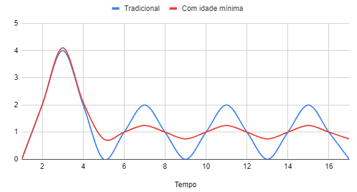

## Contexto
Em sistemas que utilizam cache para otimizar a leitura de dados, a abordagem mais comum é armazenar dados 
temporariamente e, quando o cache expira, ele é removido, forçando o sistema a buscar os dados diretamente 
da fonte original. Embora essa estratégia seja eficiente para evitar dados desatualizados, 
ela pode gerar picos de carga significativos, especialmente quando múltiplas requisições simultâneas 
precisam recarregar o cache a partir da fonte original.
Esses picos de carga podem impactar negativamente o desempenho do sistema, causar atrasos em requisições e 
sobrecarregar os recursos da infraestrutura. Além disso, em sistemas de larga escala, o descarte 
simultâneo de caches expirados pode resultar em comportamentos imprevisíveis e prejudicar a disponibilidade.
Desta forma adotar uma técnica que permita a atualização proativa do cache, antes que ele expire, 
evitando a exclusão imediata e a recarga sob demanda.

## Solução
A proposta é a introdução do conceito de **idade mínima para o cache**. 
Em vez de simplesmente descartar e remover um item do cache ao atingir o tempo de expiração, 
o sistema verificaria se o item está próximo de expirar e, ao invés de removê-lo, iniciaria um processo de atualização.
Esse processo de atualização garantiria que, quando o cache atingisse sua idade mínima, 
ele fosse automaticamente renovado, mantendo os dados atualizados sem precisar ser removido. 
O sistema poderia atualizar o cache de maneira controlada, com menos impacto em termos de picos de carga, 
abaixo uma simulação da carga de um sistema com e sem a solução.

### Vantagens
- **Redução de picos de carga:** O sistema evitaria picos de requisições à fonte original, 
pois o cache seria atualizado de maneira proativa e controlada.
- **Redução de custos:** A suavização dos picos de carga reduziria o uso de recursos de infraestrutura, 
resultando em uma menor necessidade de provisionamento de capacidade extra, o que pode reduzir custos operacionais.
- **Consistência de desempenho:** O sistema manteria um desempenho mais estável, 
já que a atualização do cache seria distribuída ao longo do tempo.
- **Disponibilidade aprimorada:** Ao minimizar o tempo em que o cache fica vazio ou inválido, 
a disponibilidade dos dados seria melhorada.

### Quando aplicar?
Essa técnica faz sentido em sistemas que têm grandes volumes de dados cacheados ou que experimentam picos de 
carga significativos quando o cache expira. Sistemas que requerem alta disponibilidade ou que 
enfrentam problemas de latência ao carregar dados da fonte original também podem se beneficiar dessa abordagem.
Sistemas que utilizam dados que mudam com frequência moderada podem obter bons resultados, pois podem possuir uma
idade minima pequena porem uma idade máxima grande para suportar momentos de diminuição de performance e disponibilidade
da fonte original.
Em sistemas onde o custo é importante esta solução pode ser uma boa abordagem também.
