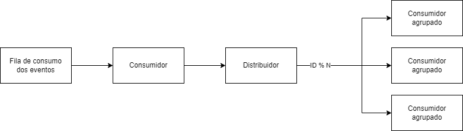

# Contexto
Fila contendo eventos de transação financeira que devem ser processadas sequencialmente conforme Id 
incremental e reincidente.

Pilares ordenados por ordem de importância: eficiência, escalabiliade, manutenibilidade, performance.

Volume esperado:

| Percentual | TPS    |
| :---       | ---:   |
| 99,99      | 10.000 |
| 99         | 1000   |
| 90         | 500    | 
| 50         | 100    |
| 10         | 10     |

# Solução

A solução consiste em um unico consumidor consumir os eventos de transação financeira, o valor do agrupador
é igual ao resto da divisão do Id da transação por N, onde N é a quantidade desejada de escala horizontal.

## Kafka
Criar uma partição por agrupador e um consumidor para cada partição.

Um único publicador no Kafka suprirá p90 e conforme o aumento da escala horizontal desejada irá suprir o pico.

## RabbitMQ
Criar uma fila por agrupador e um consumidor para cada fila.

Um único publicador no RabbitMQ suprirá p99 e conforme o aumento da escala horizontal desejada irá suprir o pico.

## Banco de dados
Criar uma tabela que contenha uma coluna indexada pelo agrupador, criar um serviço 
que consuma um unico agrupador e que leia conforme a ordem da inserção.

Um único publicador no banco de dados suprirá o pico.

## Diferenças entre as soluções
- O banco de dados pode ser uma melhor escolha para retentativas em sistemas que precisam de uma ordem perfeita.
- Caso os eventos não precisem ser armazenados o RabbitMQ provavelmente será a tecnologia mais eficiente.