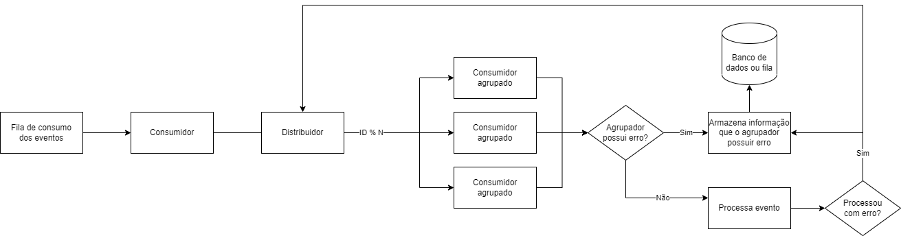

# Contexto
Este documento é um incremento de 
[processamento sequencial agrupado](ProcessamentoSequencialAgrupado.md) com a adição de uma 
complexidade de tratativa de erros, com o objetivo de manter a ordem dos eventos 
conforme um agrupamento mesmo quando processados com erro.

# Solução

A solução consiste em verificar se o Id processado possui erro, caso possua o mesmo deve ser armazenado
para ser processado posteriormente, este armazenamento também deve ocorrer ao processar 
com erro um evento. 

## Reprocessamento usando a mesma solução de processamento normal
Ao obter os eventos para reprocessamento ou processar um evento com erro, usar a mesma lógica do distribuidor.

## Lógica do "agrupador possui erro?"
Consultar um banco de dados para cada evento é custoso, como o consumidor agrupado não deve 
possuir paralelismo pode ser criado uma lógica em memória, contendo os Id's com erro.
É importante possuir um limite e ao atingi-lo este recurso não deve ser mais utilizado 
ou o consumo parar.
Outra opção é um valor booleano informando se a aplicação possui eventos com erro ou não,
para evitar chamadas ao banco de dados.

## Armazenamento dos eventos com erro utilizando RabbitMQ ou Kafka
Criar uma fila para retentativas.

## Armazenamento dos eventos com erro utilizando banco de dados
Criar uma tabela para retentativas ou uma flag na própria tabela de eventos.